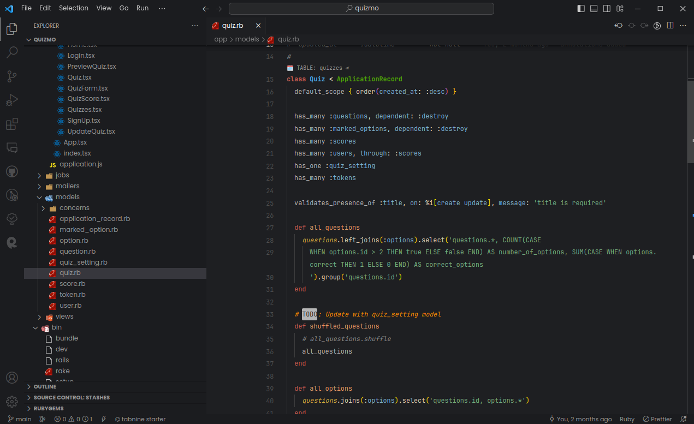

# RubyMine Theme

This is a VSCode theme that is inspired by the popular RubyMine theme. It features a dark color scheme with high contrast and bright accents for a visually appealing coding experience. The theme is designed to provide a comfortable and productive environment for developers working with Ruby and other programming languages.

- supports Ruby LSP

## Installation

You can install this theme via the VSCode Marketplace or by searching for it within VSCode. Here are the steps to install it via the Marketplace:

- Open VSCode
- Click on the extensions icon in the left-hand sidebar (or press Ctrl + Shift + X)
- Search for "RubyMine Theme"
- Click "Install"
- Click "Reload" to activate the theme

## Screenshots

Here are some screenshots of the theme in action:

## Supported Languages

This theme is designed to work with a variety of programming languages, including:

- Ruby
- Python
- JavaScript
- HTML/CSS
- Java
- C#

## Customization

If you would like to customize this theme, you can do so by modifying the settings.json file in your VSCode preferences. Here are some of the properties that you can modify:

- "workbench.colorCustomizations": This property allows you to customize the colors of specific elements in the VSCode interface, such as the editor background, text color, and selection color.
- "editor.tokenColorCustomizations": This property allows you to customize the syntax highlighting of specific programming languages.

## Feedback and Contributions

If you have any feedback or suggestions for this theme, please feel free to open an issue on the GitHub repository. Contributions are also welcome!
