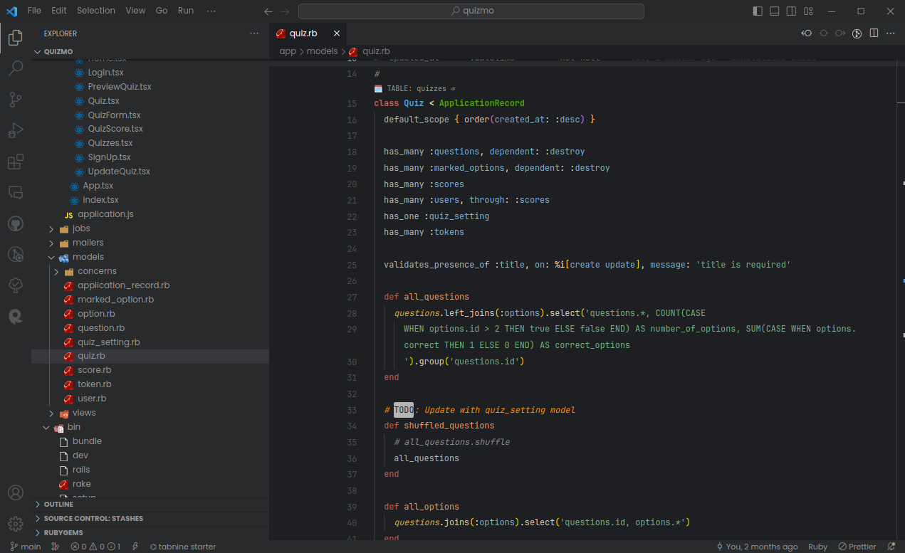
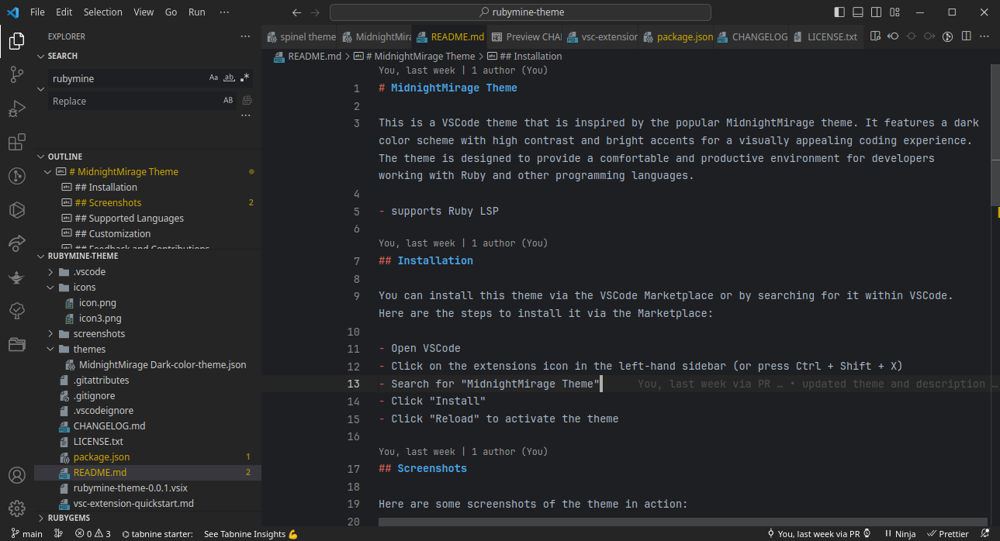

# Ruby Theme

This is a VSCode theme That has great support for ruby language. It features a dark color scheme with low contrast and muted accents for a distraction free coding experience. The theme is designed to provide a comfortable and productive environment for developers working with Ruby and other programming languages.

- Make sure to install Ruby LSP for the best experience for ruby development.

## Installation

You can install this theme via the VSCode Marketplace or by searching for it within VSCode. Here are the steps to install it via the Marketplace:

- Open VSCode
- Click on the extensions icon in the left-hand sidebar (or press Ctrl + Shift + X)
- Search for "Ruby Theme"
- Click "Install"
- Click "Reload" to activate the theme

## Screenshots

Here are some screenshots of the theme in action:

Midnight

Moonlight

Steelblue

## Customization

If you would like to customize this theme, you can do so by modifying the settings.json file in your VSCode preferences. Here are some of the properties that you can modify:

- "workbench.colorCustomizations": This property allows you to customize the colors of specific elements in the VSCode interface, such as the editor background, text color, and selection color.
- "editor.tokenColorCustomizations": This property allows you to customize the syntax highlighting of specific programming languages.

## Feedback and Contributions

If you have any feedback or suggestions for this theme, please feel free to open an issue on the GitHub repository. Contributions are also welcome!
